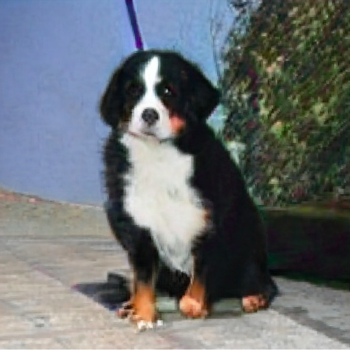
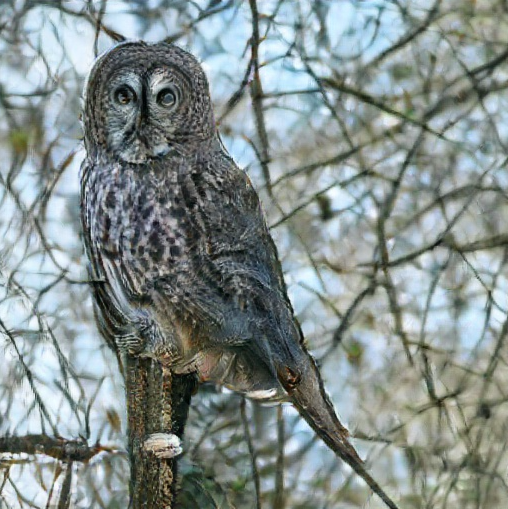

# Hackathon for Coder Academy May 2021
## DeepAI Image Generation Tool
The DeepAI Image Generator was created using the [text-to-image](https://deepai.org/machine-learning-model/text2img) model trained by [DeepAI.org](https://deepai.org/). The model is able to take text inputs (formatted as a string) and generates an original image based on existing images related to the input string. While some prompts create terrifylingly accurate creations, others miss the mark substantially, suggesting that the model needs further training with a wider variety of stimulus images.
This project was created in 48 hours for the Coder Academy Flex Track Hackathon, May 2021.

## Practical Examples

### The Good:

Prompt "dog"

Prompt "owl"

### The Bad:

Prompt "onion"

Prompt "bread"

### The Ugly:

Prompt "hash brown"

Prompt "ferocious"

## Learning Outcomes

Through working on this project, we were able to cement our knowledge of Event Listeners and Promises in JavaScript. Additionally, we took the opportunity to work with the TailwindCSS framework to create a stylish and user-friendly layout, as well as utilise responsive, mobile-first design practices. Finally, we were able to successfully integrate calls to an external API into a web application. 

## Contributors

[Theo Harris](https://github.com/Theosaurus-Rex)
[Kathryn Prestridge](https://github.com/kaprestridge)
[Mimi Romijn](https://github.com/mimi-romijn)